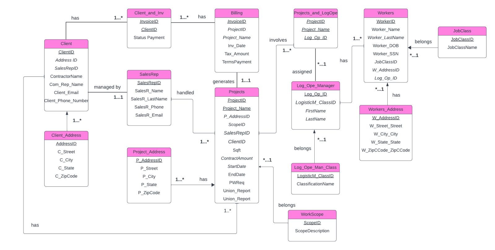

# ARS Landscaping Operations & Billing Database

**Author:** Maria Cristina Moreno Siguenza
December 2024

## Project bites 🍫

**Brief:**
This project designs and implements a relational database in Microsoft Access to centralize and analyze ARS Landscaping Corp’s nationwide project operations. The database integrates project management, client information, billing, logistics operations, workforce data, and sales activity to support operational tracking and business intelligence.

**Key insights enabled:**

* Centralized tracking of 2023 projects across multiple states

* Visibility into contract amounts, billing status, and tax amounts

* Analysis of sales representative contributions by project

* Workforce classification and logistics assignment tracking

* Improved understanding of operational efficiency and project scope distribution

**Tools:**
Microsoft Access (database design, relationships, queries), SQL (Access SQL dialect), Lucidchart (ER diagram design), GitHub (version control and portfolio documentation)

**Concepts:**
Relational Database Design, Entity-Relationship Modeling (ERD), SQL Querying, Data Normalization, Business Intelligence Foundations, Operational Analytics

## Project objective 🎯

To design and develop a centralized relational database that enables ARS Landscaping Corp to track projects completed in 2023, improve operational visibility, and support data-driven decision-making across sales, billing, logistics, and workforce management.

## Project workflow: Database Design Lifecycle
**1. Project planning**

**Motivation for the project:**
ARS Landscaping Corp operates nationwide, installing playground surfaces, running tracks, and turf systems. Prior to this project, project data related to clients, billing, logistics, and workforce assignments was fragmented, making it difficult to analyze performance or operational trends.

This project was motivated by the need to consolidate project data into a single, structured system that ensures data integrity, improves accessibility, and enables meaningful business analysis.

**Issues and opportunities addressed:**

* How many projects were completed and where (region/state)?

* What is the total contract value by project and client?

* Which sales representatives contributed to which projects?

* How are workers classified and assigned to logistics operations?

* How can billing and payment status be tracked efficiently?

## Business or organizational value

**High-level business initiative:**
Create a centralized project database to support operational efficiency and business intelligence for ARS Landscaping Corp.

**What’s the business value?**

* Enables financial performance analysis by project and client

* Improves visibility into sales activity and revenue contribution

* Supports workforce and logistics planning

* Reduces data redundancy and improves data consistency

* Provides a scalable foundation for future analytics and reporting

## Database design overview

The database is centered around the Projects entity, which connects clients, billing records, logistics operations, and workforce assignments. Supporting tables manage addresses, job classifications, sales representatives, and scope definitions to ensure normalization and relational integrity.

Key entities include:

* Clients and Client Addresses

* Projects and Project Addresses

* Billing and Invoices

* Sales Representatives

* Workers, Job Classes, and Worker Addresses

* Logistics Operations and Managers

The design follows relational best practices, using primary and foreign keys to enforce data integrity and accurately represent real-world business processes.

## Datasets

**Dataset 1: Projects (2023)**
Contains project-level information including project name, scope, contract amount, dates, client association, and sales representative assignment.

**Dataset 2: Workforce and Logistics**
Includes worker demographics, job classifications, logistics operations, and assignments related to project execution.

**Dataset 3: Billing and Invoicing**
Tracks invoices, tax amounts, payment status, and billing terms associated with each project.

*Note: Due to confidentiality, real company data is not publicly shared. The repository focuses on schema design, SQL logic, and documentation.*

## Business requirements definition: Key Performance Indicators (KPIs)

To support operational transparency and business intelligence for ARS Landscaping Corp, the following KPIs were developed based on stakeholder needs across sales, operations, billing, and workforce management.

**Number of Projects by Year**

This KPI allows the business to evaluate project volume trends over time and identify periods of higher operational demand. It supports capacity planning and long-term growth analysis.

**Total Contract Amount by Project**

This KPI measures the financial value of each project, enabling management to identify high-revenue projects and assess overall financial performance.

**Total Revenue by Client**

By aggregating contract amounts at the client level, this KPI helps identify the most valuable clients and supports client relationship management and sales strategy.

**Number of Projects by Sales Representative**

This KPI tracks individual sales performance by measuring how many projects each sales representative manages, supporting performance evaluation and incentive planning.

**Billing Status by Project**

This KPI provides visibility into invoicing and payment status, helping the finance team monitor outstanding payments, assess cash flow, and reduce billing delays.

**Workforce Distribution by Job Classification**

This KPI analyzes how workers are distributed across job classes, supporting labor planning, compliance tracking, and workforce optimization.

## Dimensional modeling
**Kimball-style Business Process Mapping**

Although this project is implemented in Microsoft Access rather than a cloud data warehouse, Kimball-style principles were applied conceptually to identify key business processes and their analytical dimensions.

The primary business processes include:

* Project execution

* Billing and invoicing

* Sales management

* Workforce and logistics operations

## Dimensional Model Overview

The database design follows dimensional modeling concepts by separating measurable facts from descriptive dimensions, allowing efficient querying and reporting.

* Fact-like tables include:

* Projects (contract amount, dates, scope)

* Billing (tax amounts, invoice dates, payment status)

Dimension tables include:

* Client

* Sales Representative

* Worker

* Job Classification

* Address (Client and Project)

This structure enables flexible analysis across financial, operational, and workforce perspectives while maintaining data integrity.

## Data extraction, transformation, and loading (ETL)
**ETL approach in Microsoft Access**

In this project, ETL processes were implemented within Microsoft Access using SQL queries and structured data imports rather than external data pipelines.

**Extract:**
Project, client, workforce, and billing data were sourced from internal company records related to projects completed in 2023.

**Transform:**
Data cleaning and transformation were performed using Access SQL queries to:

* Standardize date formats

* Normalize address information

* Enforce referential integrity through primary and foreign keys

* Validate relationships across projects, clients, billing, and workforce tables

**Load:**
The transformed data was loaded into a normalized relational schema within Access, enabling reliable querying and reporting.

This ETL approach ensures data consistency and provides a scalable foundation for future migration to enterprise data warehouses or analytics platforms.
